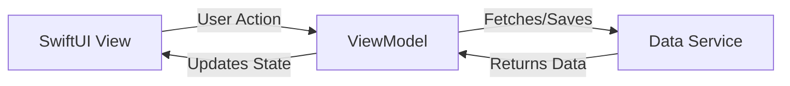

# Architecture & Engineering Decisions 🏗️

> **Document Goal:** To provide a technical deep-dive into the architectural choices behind Pekis, demonstrating a focus on scalability, maintainability, and user privacy.

## 1. High-Level Overview

Pekis is a native iOS application built using **SwiftUI**. It adheres to a strict **Unidirectional Data Flow** and leverages a **Serverless** architecture for data synchronization.

The core engineering philosophy is **"Local-First, Cloud-Sync"**. The app remains fully functional offline, synchronizing data opportunistically when connectivity is available.

---

## 2. Design Pattern: MVVM (Model-View-ViewModel)

We chose **MVVM** over other patterns (like MVC or TCA) because it offers the perfect balance of structure and simplicity for SwiftUI applications.

### Why MVVM?
*   **Separation of Concerns:**
    *   **Views** are strictly declarative. They describe *how* the UI looks based on the state. They contain **zero** business logic.
    *   **ViewModels** hold the state and business logic. They transform raw Model data into presentation-ready properties.
    *   **Models** are immutable data structures.
*   **Testability:** By isolating logic in the ViewModel (which is just a standard Swift class), we can write robust Unit Tests without needing to instantiate a UI simulator.
*   **SwiftUI Alignment:** The `ObservableObject` and `@Published` property wrappers are designed specifically to bind ViewModels to Views. When data changes, the View automatically re-renders.

### Data Flow Diagram


---

## 3. Data Strategy: CloudKit (Serverless & Privacy-First)

One of the most critical engineering decisions was the choice of the backend. We evaluated Firebase, AWS Amplify, and a custom REST API. We ultimately chose **Apple's CloudKit**.

### Why CloudKit?

#### A. Privacy by Design (The "Killer Feature")
In a relationship app, privacy is paramount.
*   **Traditional Backend:** User data sits in a central database (e.g., AWS RDS) owned by the developer. This is a security risk and a privacy liability.
*   **CloudKit:** Data is stored in the **User's private iCloud Container**.
    *   The developer (us) **cannot see** the user's data.
    *   Apple handles encryption at rest and in transit.
    *   This architectural choice eliminates the need for a complex "Privacy Policy" regarding data mining, as we literally possess no data.

#### B. Zero-Cost Scalability
*   CloudKit usage counts against the *user's* iCloud quota, not the developer's server bill.
*   This allows the app to scale to millions of users with **$0 infrastructure cost**.

#### C. Native Synchronization
*   CloudKit provides `CKShare`, a native API specifically designed for sharing records between users. This perfectly models the "Couple" relationship without needing complex permission tables in a custom SQL database.

---

## 4. Concurrency Model: Modern Swift (`async/await`)

We strictly avoid "Callback Hell" (nested closures) and the older `DispatchQueue` APIs in favor of Swift's modern concurrency model.

### Key Decisions:
*   **Structured Concurrency:** We use `Task` and `async/await` to write asynchronous code that reads like synchronous code. This drastically reduces cognitive load and bugs related to race conditions.
*   **MainActor Isolation:** All ViewModels are annotated with `@MainActor`. This compiler-enforced check ensures that UI state updates *always* happen on the main thread, eliminating a common class of crashes.

```swift
// Example of our Concurrency Pattern
@MainActor
func loadData() async {
    self.isLoading = true
    do {
        let data = try await service.fetch()
        self.items = data // Safe UI update
    } catch {
        self.error = error
    }
    self.isLoading = false
}
```

---

## 5. Directory Structure

The codebase is organized by **Feature**, not by Type. This is a "Vertical Slice" architecture.

*   **✅ Good (Feature-based):** `Features/Home/` contains the View, ViewModel, and Model for the Home screen. This makes the code modular and easy to extract.
*   **❌ Bad (Type-based):** Putting all Views in a `Views/` folder and all ViewModels in a `ViewModels/` folder creates tight coupling and makes it hard to see which files belong together.

---

## 6. Future Roadmap: CI/CD & Automation

To ensure code quality as the team grows, we have established a roadmap for DevOps:
*   **GitHub Actions:** Automated running of `PekisTests` on every Pull Request.
*   **SwiftLint:** Automated style enforcement to prevent "nitpick" comments in code reviews.

---

*This document is a living artifact and will evolve as the system scales.*
