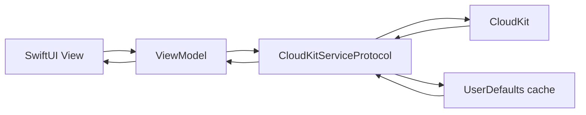

# Architecture & Engineering Decisions

> Document goal: describe the current Pekis implementation as it exists in the repository today, with emphasis on app flow, data ownership, synchronization, quality tooling, and technical tradeoffs.

## 1. High-Level Overview

Pekis is a native iOS application built with **SwiftUI** and organized around one shared concept: a paired couple relationship that powers multiple lightweight interaction surfaces.

The current system has three kinds of experiences:

- **CloudKit-backed shared features:** onboarding, couple pairing, reunion date, love notes, daily moments, and This or That answers.
- **Deterministically synchronized gameplay:** word search boards are generated locally on both devices from the same seed.
- **Local-only content features:** topic generation and date roulette draw from curated in-app content.

The most accurate way to summarize the architecture is:

**feature-based MVVM + a CloudKit service layer + selective local caching + native iOS integrations**.

It is intentionally lighter than a custom multi-service backend, but it still solves meaningful systems problems: user identity, pairing, record ownership, push-driven refresh, and graceful fallback when cloud fetches fail.

---

## 2. App Lifecycle and Root Flow

At launch, the app creates a single shared `CloudKitService` instance and passes it through the SwiftUI tree as an environment object.

### Startup responsibilities

- request local notification authorization
- initialize CloudKit and fetch the current user record ID
- create the custom record zone if needed
- check whether the user already belongs to a couple
- subscribe to CloudKit changes for both private and shared databases

### Root navigation logic

- show a loading screen while CloudKit setup is in progress
- show onboarding if the user has no couple yet or still needs to finish partner-name setup
- show the home dashboard once a valid pair exists

### Incoming share flow

When the app is opened from a CloudKit share URL:

- it fetches `CKShare.Metadata` from the incoming URL
- stores that metadata temporarily in the service
- calls `acceptShare()` to join the shared couple record
- retries the shared-record fetch because CloudKit propagation is not instantaneous

```mermaid
flowchart TD
    Launch[App Launch] --> Setup[CloudKitService.setup()]
    Setup --> Zone[Create CoupleZone if needed]
    Zone --> Existing{Existing couple found?}
    Existing -->|No| Onboarding[CoupleOnboardingView]
    Existing -->|Yes| Home[HomeView]
    ShareURL[Incoming cloudkit share URL] --> Metadata[Fetch CKShare metadata]
    Metadata --> Accept[acceptShare()]
    Accept --> Existing
```

This flow is important because it shows the app is not just rendering static views. It is coordinating launch-time cloud state, local state, and deep-link-based pairing.

---

## 3. Code Organization

The repository uses a mostly feature-based layout, with shared domain logic pulled into `Core` and reusable UI in `Shared`.

### Top-level structure

- `App/`: app entry point and root bootstrapping
- `Core/Data/`: curated content and constants
- `Core/Models/`: shared data models and CloudKit record mapping
- `Core/Services/`: CloudKit, sharing, game-session coordination, puzzle generation
- `Core/Utilities/`: haptics and local notifications
- `Features/Home/`: dashboard and all main activity screens
- `Features/Onboarding/`: couple creation and join flow
- `Shared/Components/`: reusable SwiftUI building blocks

This structure keeps product features easy to navigate while centralizing the storage and sync concerns that need to be shared across the app.

---

## 4. State Management and MVVM

Pekis follows a strict MVVM approach that fits naturally with SwiftUI.

### View responsibilities

- describe layout and navigation
- bind to observable state
- forward user intent to the relevant ViewModel

### ViewModel responsibilities

- own feature state through `@Published` properties
- call async service methods
- transform raw model data into presentation-ready values
- keep business logic out of the view layer

### Service responsibilities

- encapsulate persistence and synchronization
- provide protocol-based APIs for ViewModels
- manage CloudKit setup, routing, and error translation

### Dependency injection strategy

- the app owns `CloudKitService` as a `@StateObject`
- root and onboarding views access it through `@EnvironmentObject`
- feature ViewModels receive `any CloudKitServiceProtocol` through their initializers
- previews and tests can use `MockCloudKitService`

This combination gives the app a clear source of truth while still keeping individual features testable and decoupled from the concrete CloudKit implementation.



---

## 5. Data Strategy: CloudKit, Sharing, and Local Cache

### 5.1 Why CloudKit is the Core Persistence Layer

Pekis stores persistent couple data in **CloudKit** instead of a custom backend.

That choice gives the project three advantages:

- **privacy:** relationship content is stored in the user's iCloud-backed data plane rather than a custom database for notes, answers, or shared photos
- **native sharing:** `CKShare` maps naturally to the app's couple-pairing model
- **platform integration:** push subscriptions, share links, and private/shared databases are first-class Apple APIs

There is one important nuance: Word Search uses CloudKit not only for persistent couple data, but also for a short-lived shared session record that coordinates readiness, countdown timing, and winner detection. Persistent relationship content and transient game coordination now live within the same Apple-managed trust boundary.

### 5.2 CloudKit Topology in the Current Implementation

The current `CloudKitService` manages:

- one CloudKit container
- the **private database** for the record owner
- the **shared database** for accepted shares
- a custom `CoupleZone`
- an in-memory reference to the current couple record and share record

### Pairing model

1. Partner A creates a `Couple` record in `CoupleZone`.
2. The service creates or retrieves a private `CKShare` for that record.
3. Partner A distributes the share link.
4. Partner B opens the link and the app accepts the share metadata.
5. The service fetches the shared record, fills in Partner B identity if needed, and updates local state.

### Database routing model

One of the more important implementation details is that feature writes are routed based on the owning zone.

- if the zone owner is the current user, writes go to the private database
- if the record belongs to a partner-owned shared zone, writes go to the shared database

That logic is what lets both partners interact with the same shared couple data even though CloudKit ownership is asymmetric.

### 5.3 Model Layer and Record Mapping

The main shared models are:

- `Couple`
- `LoveNote`
- `ThisOrThatAnswer`
- `MomentShareRecord`

Each model is responsible for translating between app state and CloudKit state.

Common patterns in the codebase:

- a `recordType` constant
- a `RecordKey` enum
- `init?(record: CKRecord)` for decoding
- `toRecord(...)` for encoding
- optional cache helpers for local fallback

This keeps the storage boundary explicit and prevents the sync code from turning into anonymous dictionary manipulation.

### 5.4 Selective Local Caching

The app uses **selective local cache**, not a universal offline persistence layer.

Currently cached:

- `Couple`
- arrays of `LoveNote`
- arrays of `ThisOrThatAnswer`

Not broadly cached:

- `MomentShareRecord` image history
- generic pending writes across every feature

The practical result is that the app can recover gracefully for identity and some text-based shared state, but it does not claim full offline parity for every feature.

### 5.5 Consistency Model

The current consistency model is best described as:

- **eventual consistency through CloudKit**
- **retry-aware share acceptance**
- **record-level overwrite behavior that effectively resembles last-writer-wins**

The app does not implement CRDTs or a custom merge engine. That is a deliberate simplification appropriate for the scale and product shape of the current project.

---

## 6. Push-Driven Refresh Architecture

Pekis uses CloudKit subscriptions to refresh shared data when something changes.

### Current flow

1. The service subscribes to both the private and shared databases.
2. CloudKit delivers a silent push when subscribed data changes.
3. `AppDelegate` receives the notification and forwards it to `CloudKitService`.
4. The service re-checks current couple state and posts a custom notification.
5. Feature ViewModels listen for that notification and refetch their specific data.

```mermaid
flowchart LR
    CK[CloudKit data change] --> Push[Silent push]
    Push --> AppDelegate[UIApplicationDelegate]
    AppDelegate --> Service[CloudKitService.handleNotification]
    Service --> Refresh[checkExistingCouple()]
    Service --> Notify[NotificationCenter post]
    Notify --> FeatureVMs[Feature ViewModels refetch]
```

This pattern is intentionally simple. It avoids maintaining a complex realtime socket layer while still letting shared features respond quickly to remote updates.

---

## 7. Feature Implementation Details

### 7.1 Onboarding and Pairing

The onboarding flow is a multi-step state machine that covers:

- welcome
- name entry
- create-or-join branching
- waiting for partner
- completion

It supports both sides of the couple relationship:

- the creator path creates the `Couple` record and fetches a share URL
- the joiner path accepts the share, then prompts for the missing partner name if necessary

The project also includes a SwiftUI wrapper around `UICloudSharingController`, which bridges a UIKit-only sharing API into the SwiftUI architecture cleanly.

### 7.2 Dashboard and Home Shell

The home screen acts as a navigation hub rather than a passive landing page.

It exposes:

- partner context
- reunion countdown and editing flow
- invite-link recovery when a partner has not joined yet
- entry points into every activity module

This is a small but important architectural decision: the dashboard is where long-lived shared state is surfaced and where feature navigation is centralized.

### 7.3 Love Notes and This or That

These two features show the text-first CloudKit path most clearly.

- both are backed by explicit model-to-record serialization
- both refetch on push notifications
- both support cache fallback when fetches fail

They are good examples of the app's pragmatic sync model: lightweight records, simple query predicates, and refresh behavior driven by CloudKit rather than by a custom event bus.

### 7.4 Moment Share

Moment Share is the most media-heavy feature in the app.

- images are compressed to JPEG
- written to a temporary file
- uploaded to CloudKit as `CKAsset`
- fetched back as asset-backed image data for display

This is a strong detail to keep in mind because it demonstrates that the project is handling binary data, not just text records.

### 7.5 Word Search and Session Coordination

Word Search combines algorithmic generation and lightweight coordination.

### Puzzle generation

- a custom `LinearCongruentialGenerator` provides deterministic randomness
- a CloudKit `WordSearchSession` record stores the shared seed for the current round
- both players can generate the same puzzle independently without board-state exchange

### Session coordination

- a coordination service exposes status and opponent-win signals
- one implementation simulates matchmaking locally for development
- the paired-couple path writes and refreshes a short-lived CloudKit session record in the shared couple zone
- both devices use the stored `scheduledStartAt` timestamp to align the countdown without a custom backend
- the waiting-room UI surfaces local readiness, partner readiness, and the synced scheduled start before gameplay begins

This is synchronized play, but not a shared authoritative game state. Players see the same board and coordinate game readiness, while their moment-to-moment tile selection remains local.

### 7.6 Local Content Features

Date Roulette and Topic Generator are intentionally local and content-driven.

- `AppContent` stores the curated prompts, ideas, quotes, and word pool
- these features avoid network dependencies entirely
- the content layer acts as a lightweight domain dataset for product experimentation

These modules matter because they show the app is not only about storage and sync. It also contains product design choices about pacing, intimacy, and repeatable engagement.

---

## 8. Concurrency Model

The codebase adopts modern Swift concurrency broadly.

### Current patterns

- service methods use `async` and `throws`
- ViewModels call those services from `Task` or `async` functions
- `@MainActor` is applied to the CloudKit service and feature ViewModels
- retry flows use `Task.sleep` rather than callback pyramids

### Why this matters

- UI state updates remain main-thread safe
- async control flow is easier to reason about
- CloudKit operations, share propagation delays, and feature refreshes stay readable and testable

Combine still exists, but only in a narrow role for game-session state streams. The broader app does not depend on Combine-heavy pipelines for ordinary async work.

---

## 9. Native iOS Integrations

Pekis uses several platform-specific capabilities beyond plain SwiftUI rendering.

### CloudKit and sharing

- CloudKit entitlements
- `CKShare`
- private and shared databases
- CloudKit silent pushes

### Device features

- local notifications for reunion countdown reminders
- haptic feedback across interaction flows
- `PhotosPicker` and `UIImage` handling for photo moments

These integrations make the app feel like an actual iOS product rather than a cross-platform prototype ported into SwiftUI.

---

## 10. Testing, Linting, and Automation

### 10.1 Testing Strategy

The repo uses a mixed testing stack.

### Strongest automated coverage

- model round-trip tests for CloudKit record conversion
- local cache behavior checks
- This or That comparison logic
- word search generator and selection behavior
- computed-property validation in `HomeViewModel`

### Frameworks in use

- the main unit test target uses the modern **Swift Testing** framework (`@Test`, `#expect`)
- the word search test file still uses **XCTest**
- the UI test target exists, but is currently close to template-level launch coverage

This is a pragmatic quality setup: the most important data and logic surfaces are tested, while end-to-end UI coverage is still lightweight.

### 10.2 Linting

The project includes:

- a `.swiftlint.yml` configuration
- a build-phase script that runs SwiftLint if installed
- line-length, whitespace, complexity, and force-cast/force-try checks

This keeps style enforcement close to the build and helps preserve consistency in a SwiftUI-heavy codebase.

### 10.3 CI Automation

GitHub Actions currently provides a **build-and-test** workflow.

The workflow:

- runs on pushes to `main` and pull requests targeting `main`
- builds the app with `xcodebuild`
- runs tests on an iPhone simulator destination
- disables code signing for CI execution

This is meaningful CI, but it should be described accurately as verification automation rather than a full deployment pipeline.

---

## 11. Strengths and Current Constraints

### Current strengths

- clear MVVM separation with protocol-backed service boundaries
- privacy-conscious persistent data architecture
- native sharing and push integration through CloudKit
- deterministic shared gameplay without a heavyweight backend
- selective local cache for resilience
- contributor docs, linting, tests, and CI already in place

### Current constraints and tradeoffs

- persistent data and word-search coordination are both CloudKit-based, but gameplay remains coordinated rather than fully realtime
- synchronized gameplay is deterministic and coordinated, not a fully live shared-state multiplayer session
- offline support is partial and selective rather than universal
- UI test coverage is still minimal compared with unit and logic coverage
- CI validates build and tests, but does not yet include richer reporting such as coverage or deployment automation

These tradeoffs are acceptable for the current stage of the product. More importantly, they are explicit. The architecture reflects deliberate scope control rather than accidental sprawl.

---

## 12. Closing Summary

Pekis is architected as a privacy-conscious, feature-oriented SwiftUI app where CloudKit carries the persistent shared relationship state, local generation powers synchronized play, and modern Swift concurrency keeps the code predictable.

Its strongest engineering themes are:

- native Apple-platform integration
- clean separation of UI and business logic
- thoughtful handling of sync and sharing constraints
- practical quality discipline through tests, linting, and CI

That combination makes the project a strong example of real mobile systems design applied to a human-centered product problem.
