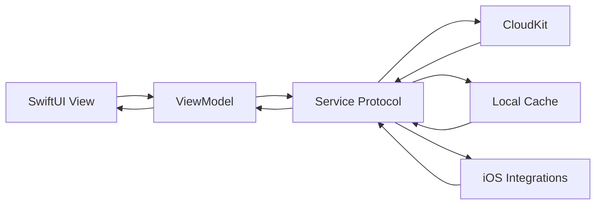

# Pekis 🐧


**Pekis** is a dedicated iOS application designed to bridge the gap for couples in long-distance relationships. Built with **SwiftUI** and a privacy-conscious architecture, it provides a shared digital space for connection, play, and intimacy without relying on a heavy custom backend for core relationship data.

> **Technical Overview:** Pekis uses feature-based MVVM, structured concurrency (`async/await`), CloudKit sharing for persistent couple data, and lightweight deterministic coordination for shared gameplay.

Repository docs: [ARCHITECTURE.md](ARCHITECTURE.md), [DEVELOPMENT.md](DEVELOPMENT.md), [CONTRIBUTING.md](CONTRIBUTING.md), [PRIVACY.md](PRIVACY.md), [SECURITY.md](SECURITY.md).

---

## 🎯 Project Goal

Long-distance relationships are hard. Texting isn't always enough. Pekis aims to provide meaningful interactions through structured activities rather than just passive messaging.

**Core Philosophy:**
*   **Intentionality:** Every feature is designed to spark a specific type of connection (fun, deep, or spontaneous).
*   **Privacy:** Your relationship data belongs to you, not a server.
*   **Native Experience:** A SwiftUI-first interface with native iOS integrations where they add real value.

---

## ✨ Features

*   **📸 Moment Share:** Daily photo sharing backed by CloudKit `CKAsset` uploads.
*   **💌 Love Notes:** Shared notes that sync across the paired couple space.
*   **🎲 Date Roulette:** A local date-idea spinner powered by curated in-app content.
*   **🗣️ Topic Generator:** Conversation starters drawn from a built-in prompt library.
*   **🧩 Word Search:** A synchronized puzzle experience where both devices generate the same board from a shared session seed, with CloudKit-backed ready/start coordination.
*   **⚖️ This or That:** A compatibility game that stores both partners' answers and reveals matches over time.

---

## 📸 Screenshots

| Dashboard | Moment Share | Word Search |
|:---:|:---:|:---:|
| ** | ** | ** |
| *Your shared home* | *Share your world* | *Play together* |

*(Note: Screenshots are placeholders. Please run the app to see the UI in action!)*

---

## 🔒 Privacy-First Sync Model

Pekis is built around **CloudKit-backed couple data with selective local caching**.

*   **No Traditional Relationship Backend:** Core shared data does not live in a custom database owned by the developer.
*   **CloudKit for Persistent Shared State:** Couple data, love notes, This or That answers, and photo moments are stored through Apple's private/shared CloudKit databases.
*   **Selective Local Cache:** Couple state, notes, and answer history can fall back to cached local data when cloud fetches fail.
*   **Deterministic Shared Play:** Word Search synchronizes the board through on-device generation from a shared seed rather than a live shared-state game server.
*   **Shared Session Coordination:** Word Search uses a short-lived CloudKit session record for ready state, countdown timing, and winner detection; it is not a peer-to-peer transport layer.
*   **Publish-Ready Repo Surface:** Security reporting, privacy boundaries, contribution rules, and development setup are documented in-repo for external contributors.

---

## 🛠 How to Build

### Prerequisites
*   Xcode 15.0+
*   iOS 17.0+ Simulator or Device

### Installation
1.  **Clone the repository:**
    ```bash
    git clone https://github.com/martinnss/Pekis.git
    cd Pekis
    ```

2.  **Create your local environment file:**
    Copy `.env.example` to `.env` and replace the team ID, bundle identifier, and CloudKit container with values you control.

3.  **Open the project:**
    Double-click `Pekis.xcodeproj` to open in Xcode.

4.  **Verify signing and capabilities when needed:**
    If you plan to test CloudKit flows on a signed simulator or physical device, confirm the Pekis target still has the iCloud and CloudKit capabilities enabled for the identifiers you put in `.env`.

5.  **Build and Run:**
    Press `Cmd + R` to build and run on your selected simulator.

### Configuration (Optional)
*   **Linting:** This project uses `SwiftLint` to enforce code style. If you don't have it installed, the build script may warn you. Install it via Homebrew: `brew install swiftlint`.
*   **Environment:** Copy `.env.example` to `.env` and set your Apple team, bundle identifier, and CloudKit container before working on signed CloudKit flows.

---

## 🏗 Architecture

Pekis is organized as **feature-based MVVM + a protocol-oriented service layer + CloudKit-backed shared state**. The design goal is to keep the SwiftUI surface simple while concentrating persistence, synchronization, and platform-specific behavior in well-defined services.

For a deeper breakdown, see [ARCHITECTURE.md](ARCHITECTURE.md).

### Architecture at a Glance

*   **Views:** Declarative SwiftUI screens responsible for layout, navigation, and user interaction.
*   **ViewModels:** `@MainActor` observable objects that own feature state through `@Published` properties and call async services.
*   **Models:** Lightweight structs that map cleanly to CloudKit records and, where needed, local cache storage.
*   **Services:** Protocol-backed infrastructure for CloudKit, sharing, matchmaking, puzzle generation, haptics, and notifications.
*   **Data Strategy:** CloudKit stores persistent couple state, while local caches provide resilience for selected shared text-based data.
*   **Gameplay Coordination:** Word Search uses deterministic on-device generation plus a shared CloudKit session instead of a heavyweight live multiplayer backend.



### Runtime Flow

At launch, the app creates a single shared `CloudKitService`, injects it into the SwiftUI tree, and uses it as the source of truth for pairing and shared data.

*   **Startup:** request local notification permissions, initialize CloudKit, create the custom record zone if needed, fetch the current user identifier, and check for an existing couple.
*   **Root routing:** show a loading screen while cloud setup is in progress, onboarding if the user is not paired, and the home dashboard once a valid couple exists.
*   **Share acceptance:** when the app opens from a CloudKit share URL, it fetches `CKShare.Metadata`, accepts the share, and retries the fetch path to account for CloudKit propagation delay.

```mermaid
flowchart TD
    Launch[App Launch] --> Setup[CloudKitService.setup()]
    Setup --> Check{Paired couple exists?}
    Check -->|No| Onboarding[CoupleOnboardingView]
    Check -->|Yes| Home[HomeView]
    Share[Incoming share URL] --> Metadata[Fetch CKShare metadata]
    Metadata --> Accept[acceptShare()]
    Accept --> Check
```

### Shared Data and Sync Topology

Pekis uses **CloudKit** for persistent relationship data instead of a traditional custom backend.

*   **Private + shared databases:** Partner A owns the original couple record in a custom `CoupleZone`; Partner B joins through `CKShare` and accesses the shared graph through CloudKit's shared database.
*   **Protocol-driven sync layer:** `CloudKitServiceProtocol` gives ViewModels a stable interface while the concrete `CloudKitService` manages zone creation, record routing, sharing, subscriptions, and error handling.
*   **Selective local caching:** `Couple`, `LoveNote`, and `ThisOrThatAnswer` can fall back to local cache; this improves resilience without claiming universal offline-first support.
*   **Push-driven refresh:** CloudKit subscriptions trigger silent pushes, the app delegate forwards them to `CloudKitService`, and feature ViewModels refetch their own data after a notification fan-out.

This yields an architecture that is privacy-conscious, native to the Apple ecosystem, and realistic about mobile sync constraints such as eventual consistency and share-propagation delay.

### Deterministic Shared Gameplay

The Word Search feature is architecturally distinct from the CloudKit-backed record flows.

*   **Deterministic board generation:** both devices generate the same puzzle locally from a shared CloudKit session seed using a custom random-number generator.
*   **Lightweight session coordination:** a short-lived shared record coordinates readiness, countdown timing, victory signals, and the synced waiting-room state.
*   **Explicit tradeoff:** the app delivers synchronized play without maintaining a live authoritative game server or syncing per-move board state.

This is a good example of scope-aware systems design: shared experience through local computation rather than infrastructure-heavy realtime state management.

### Repository Structure

```
Pekis/
├── App/              # App entry point and lifecycle bootstrapping
├── Core/
│   ├── Data/         # Curated prompts, quotes, and content pools
│   ├── Models/       # Shared domain models and CloudKit mappings
│   ├── Services/     # CloudKit, sharing, matchmaking, puzzle generation
│   └── Utilities/    # Haptics and local notifications
├── Features/
│   ├── Home/         # Dashboard and activity features
│   └── Onboarding/   # Couple creation and join flow
└── Shared/           # Reusable UI components
```

## ✅ Quality Tooling

*   **Testing:** The repository uses both Swift Testing and XCTest, with the strongest automated coverage around CloudKit record mapping, cache behavior, HomeViewModel logic, and word-search generation/selection behavior.
*   **Linting:** SwiftLint runs from a build-phase script when installed locally and is configured through `.swiftlint.yml`.
*   **CI:** GitHub Actions performs build-and-test verification on pushes to `main` and pull requests targeting `main`.
*   **Documentation:** `README.md`, `ARCHITECTURE.md`, and `CONTRIBUTING.md` document the system design, contributor expectations, and quality bar.

---

## 🤝 Contributing

We welcome contributions! Whether you're fixing a bug, adding a new "Date Idea," or translating the app.

1.  Fork the Project.
2.  Create your Feature Branch (`git checkout -b feature/AmazingFeature`).
3.  Commit your Changes (`git commit -m 'Add some AmazingFeature'`).
4.  Push to the Branch (`git push origin feature/AmazingFeature`).
5.  Open a Pull Request.

Please read [CONTRIBUTING.md](CONTRIBUTING.md) for details on our code of conduct and development process.

## 🔐 Security and Privacy

If you discover a vulnerability, follow [SECURITY.md](SECURITY.md) instead of opening a public issue. For implementation and data-handling boundaries, see [PRIVACY.md](PRIVACY.md).

---

## 📄 License

Distributed under the MIT License. See `LICENSE` for more information.

---

*Built with 💜 by Martin for LDR couples everywhere.*
